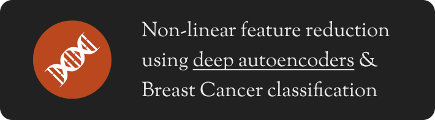
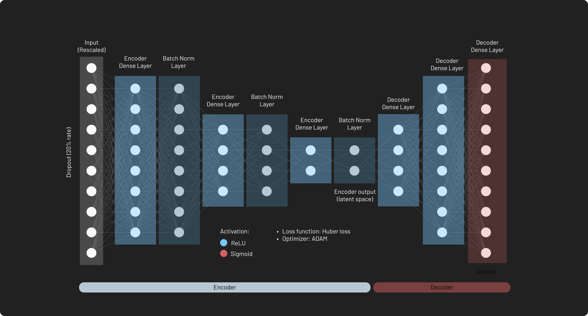
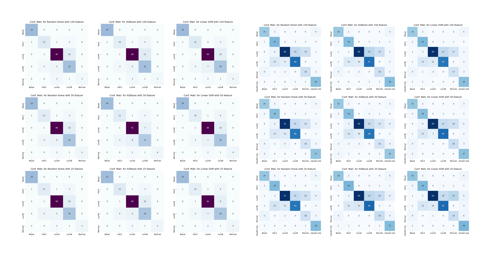

  

## Project summary

This repository contains the implementation of my bachelor degree project. The aim of the project is to apply non-linear feature reduction through **deep autoencoders** to 2 kinds of datasets obtained from two different genomic profiling technique: **RNASeq** and **Microarray**. The reduced datasets will be used to create models that predict clinical data, such the **breast cancer subtype**, with high accuracy. The following image represent a (much) smaller example of (one type of) the deep autoencoder architecture. You can read more on the [thesis](https://github.com/LemuelPuglisi/non-linearfeature-reduction-and-breast-cancer-prediction/blob/main/thesis/thesis.pdf), inside the `thesis` folder.

  

## Steps to reproduce

In order to get the datasets, [mail me](mailto:lemuelpuglisi001@gmail.com). Then: 

* Unzip each dataset
* Put the NGS dataset content inside `datasets/ngs`
* Put the microarray dataset content inside `datasets/microarray`

The you can reproduce all the steps from the thesis using the notebooks. I recommend to examine the notebooks in the specified order (check the index from the file name). 

## Confusion matrices preview

  

### Author 

* Dr. Puglisi Lemuel @ DMI, UniCT
